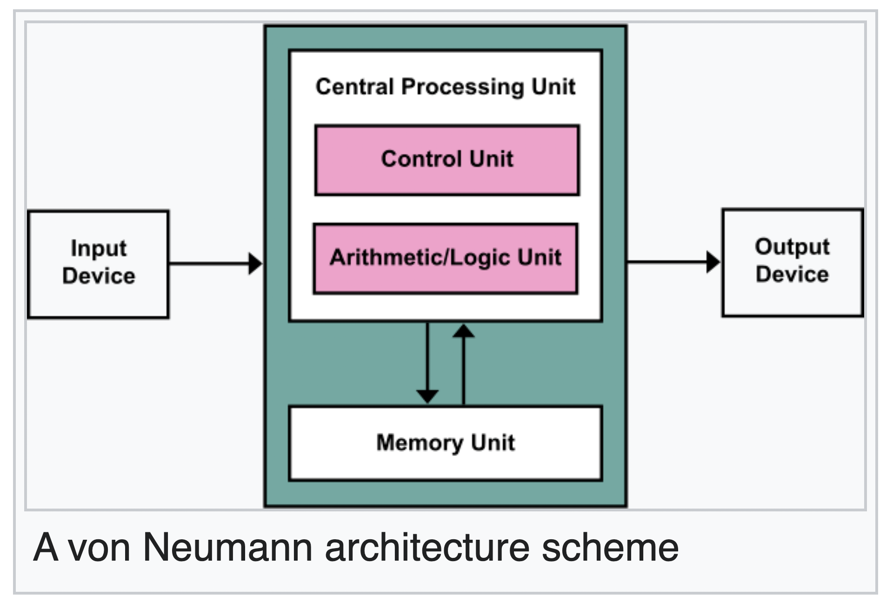
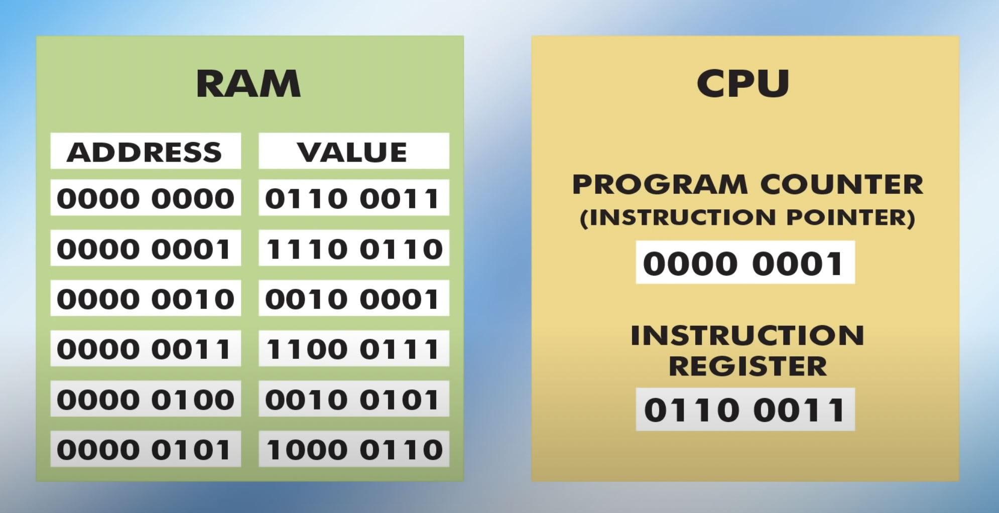
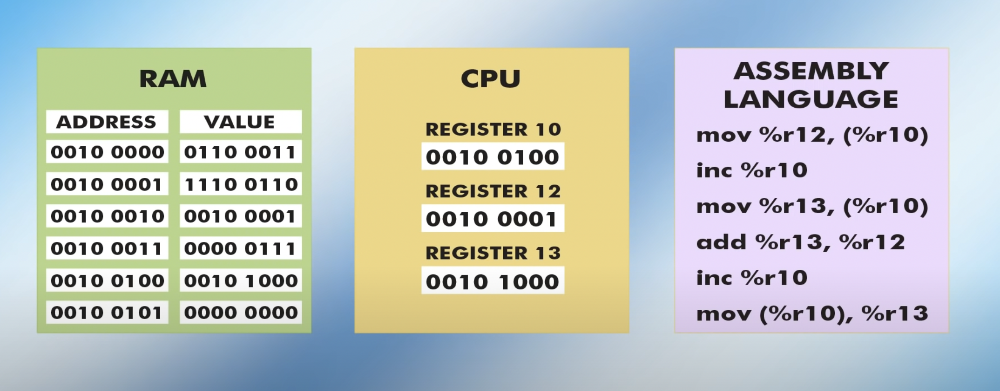
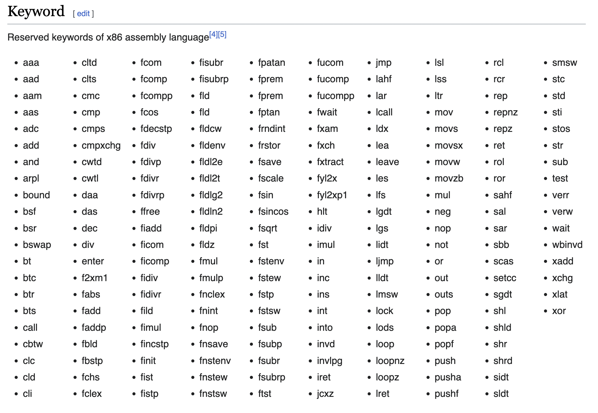
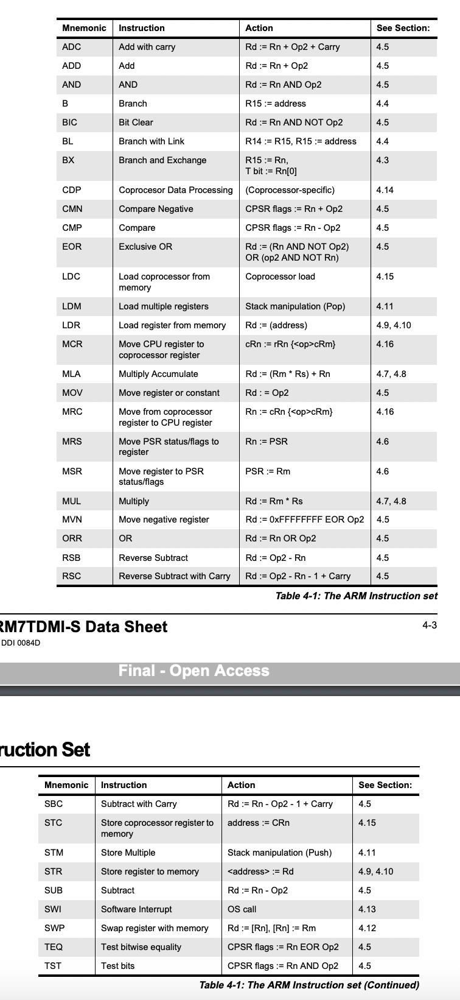

# **5-Day Computer Science Bootcamp for Engineers**

*Welcome to the jungle! Get ready to dance with the Python and embark on a GUIde to making something useful. This 5-day bootcamp is designed to give you a survival kit in Linux, an introduction to programming, and the basics of user interface development—all while keeping things fun and engaging.*

**Schedule:** Each day runs from **09:00 to 12:00** and **13:00 to 17:00**, totaling **7 hours** per day.

---

## **Day 1 (Monday): Into the Wild—Computers and Operating Systems**

### **Morning Session (09:00 - 12:00)**

### **1. Welcome and Bootcamp Overview** *(15 minutes)*

- **Objectives:**
  - Introduce the bootcamp's structure with a flair of adventure.
  - Set expectations and get everyone excited for the week ahead.

### **2. What's a Computer?** *(2 hours 45 minutes)*

#### **2.1 The Processor: Architecture and Instruction Sets** *(45 minutes)*

[How Do CPUs Work? - ExplainingComputers (YouTube)](https://www.youtube.com/watch?v=jx-w2o-Lj8g)

- **Key Points:**
  - The CPU's role as the brain of the computer—no neurology degree required.
  - Basic fetch-decode-execute cycle—how the CPU takes commands and makes magic happen.
  - Introduction to the Instruction Pointer (EIP) and how it keeps the CPU on track.
  - CPUs vs. GPUs: Why your graphics card can't do your taxes (yet).

- **Notes:**

  - (John) Von Neumann Architecture (1945)
    - Control Unit
    - Arithmetic Logic Unit
    - Memory
    - Input/Output

  

  - registers can store:
    - instructions
    - data
    - memory addresses
  - buses:
    - data
    - address
    - control

  - clock
    - Ghz: billions of cycles per second
  - fetch, decode, execute cycle
    - Program Counter or Instruction Pointer
      - points to the next instruction in memory
    - Control Unit
      - fetches the instruction to the Instruction Register
      - increments the Program Counter
      - decodes it
      - executes it
    
  
  

  - machine code: instruction set of a CPU
    - assembly language
      - low-level programming language
      - still compiled to machine code
    - x86 (Intel 8086, 1978)
      - CISC (Complex Instruction Set Computer)
      - [opcodes](http://ref.x86asm.net/coder32.html)
      
    - ARM
      - RISC (Instruction Set Computer)
        - less specialised instructions
        - more instructions to execute a task
        - faster execution because easier to optimise
      - just a licence used by Apple, Qualcomm, Samsung, etc.
      
    - RISC-V
      - like ARM but open-source

#### **2.2 Storage** *(30 minutes)*

- **Key Points:**
  - HDDs vs. SSDs: One spins, one doesn't, both hold your memes.
  - How data is stored and why you should care about read/write speeds.
  - The joy of waiting for a file to load—or not.

#### **2.3 RAM** *(30 minutes)*

- **Key Points:**
  - RAM: The computer's short-term memory (no goldfish jokes here).
  - How RAM affects multitasking—why 100 browser tabs might slow you down.
  - Difference between RAM and storage: One forgets, one forgives.

#### **2.4 PCI and Peripheral Devices** *(30 minutes)*

- **Key Points:**
  - What is PCI? Think of it as the computer's expansion slot for new gadgets—because who doesn't like upgrades?
  - Common devices: Network cards, sound cards—your computer's favorite accessories.
  - How peripherals communicate with the CPU—it's all about connecting the dots.

### **Lunch Break (12:00 - 13:00)**

### **Afternoon Session (13:00 - 17:00)**

### **3. Operating Systems Overview** *(2 hours)*

#### **3.1 Windows: The Good, the Bad, and the Ugly** *(45 minutes)*

- **The Good:**
  - **Wide Availability:** Like coffee shops, Windows is everywhere.
  - **Software Support:** Runs a vast array of applications—from AAA games and Adobe Creative Suite to niche professional software.
  - **Compatibility with Legacy Systems:** Your old software feels right at home.

- **The Bad:**
  - **Viruses:** Windows catches more bugs than a swamp in summer.
  - **Bugs and Glitches:** Ever seen the Blue Screen of Death? It's not a metal band.
  - **Dubious Architecture Choices:** Sometimes, even Windows doesn't know what Windows is doing.

- **The Ugly:**
  - **Spying:** Big Brother might be watching—you didn't need privacy, did you?

#### **3.2 macOS is BSD: Story of a Monolith** *(30 minutes)*

- **Key Points:**
  - macOS roots in BSD Unix—Apple didn't fall far from the tree.
  - The elegance of integration—when hardware and software finish each other's sentences.
  - Limitations: You can have any color you like, as long as it's space gray.

#### **3.3 The World of Linux** *(45 minutes)*

- **Key Points:**
  - Linux: The open-source underdog that's everywhere.
  - Distributions galore—Ubuntu, Fedora, Debian—collect them all!
  - Customization: Linux is like Lego for your computer.
  - Where Linux Falls Short: Despite its strengths, Linux can lack support for certain proprietary software and games, making it less ideal for some users. It also often requires getting your hands dirty to drill down into issues, but there is almost always a way out of any issue.

### **4. Linux Architecture** *(2 hours)*

#### **4.1 The Kernel and Userland** *(30 minutes)*

- **Key Points:**
  - Kernel: The bouncer of your system—decides who gets in.
  - Userland: Where all the apps hang out.
  - Interaction between hardware and software—making the magic happen.

#### **4.2 File-Based System and UNIX Directories** *(30 minutes)*

- **Key Points:**
  - Everything is a file—even your keyboard, sort of.
  - Navigating the filesystem: Why root is not just for plants.
  - Common directories: `/home` is where the heart is.

#### **4.3 Permissions, Groups, and Owners** *(30 minutes)*

- **Key Points:**
  - Users and groups: It's like social media for files.
  - File permissions: Read, write, execute—permissions so important, they deserve their own rules.
  - Changing permissions: Use `chmod` and `chown` to manage access.

#### **4.4 Command Line Basics** *(30 minutes)*

- **Key Points:**
  - Terminal vs. shell vs. console—when words get confusing.
  - Basic commands: `ls`, `cd`, `pwd`—the holy trinity.
  - Standard input/output: Talk to your computer without emojis.

---

## **Day 2 (Tuesday): Surviving in the Linux Wilderness**

### **Morning Session (09:00 - 12:00)**

### **1. Setting Up Camp: Creating a Debian Virtual Machine** *(1 hour)*

- **Activities:**
  - Install VirtualBox or your virtualization tool of choice.
  - Step-by-step guide to installing Debian—no compass needed.
  - Configuring settings: Making sure your virtual machine doesn't feel virtual.

### **2. Navigating the Command Line Jungle** *(2 hours)*

#### **2.1 File and Directory Operations** *(1 hour)*

- **Commands:**
  - `ls`: List directory contents—see what's in the jungle.
  - `cd`: Change directory—explore new territories.
  - `pwd`: Print working directory—so you don't get lost.
  - `mkdir`: Make directories—build your own treehouses.
  - `rm`: Remove files or directories—clean up the camp.
  - `cp`: Copy files or directories—because cloning is cool.
  - `mv`: Move or rename files or directories—rearrange your stuff.
  - `touch`: Create empty files—start something new.
  - `cat`: Concatenate and display file contents—let the cat out of the bag.
  - `echo`: Display a line of text—make your computer talk.
  - `chmod`: Change file permissions—be the gatekeeper.
  - `chown`: Change file owner and group—assign ownership.

#### **2.2 Text Processing and Utilities** *(1 hour)*

- **Commands:**
  - `grep`: Search text using patterns—find what you're looking for.
  - `find`: Search for files—find that needle in the haystack.
  - `wc`: Word count—count words, lines, and characters.
  - `rev`: Reverse lines characterwise—because reading backward is fun.
  - `head` and `tail`: Display beginning or end of files—get the gist quickly.
  - `env`: Show environment variables—see what's in the air.

### **Lunch Break (12:00 - 13:00)**

### **Afternoon Session (13:00 - 17:00)**

### **3. Essential Linux Commands Continued** *(1 hour)*

#### **3.1 System Information and Monitoring** *(30 minutes)*

- **Commands:**
  - `htop`: Interactive process viewer—feel like a hacker.
  - `df`: Report file system disk space usage—avoid running out of space.
  - `du`: Estimate file space usage—find what's hogging space.
  - `free`: Display memory usage—see how much RAM is free.

#### **3.2 Networking Commands** *(15 minutes)*

- **Commands:**
  - `ping`: Check connectivity—test if the server is alive.
  - `ifconfig` or `ip`: Configure network interfaces—networking basics.
  - `ssh`: Secure Shell—connect to remote machines securely.

#### **3.3 Help and Documentation** *(15 minutes)*

- **Commands:**
  - `man`: Manual pages—RTFM (Read The Fine Manual).
  - `--help`: Quick help for commands—get brief usage info.

### **4. Bash Is a Programming Language** *(2 hours)*

#### **4.1 Writing Simple Scripts** *(1 hour)*

- **Key Concepts:**
  - Starting a script: `#!/bin/bash`—because magic numbers are cool.
  - Variables and loops: Make your script do the heavy lifting.
  - Permissions: Make it executable—feel powerful.

#### **4.2 Bash Project: Calendar Creator** *(1 hour)*

- **Activity:**
  - Create a script that generates a directory for each month.
  - Inside each month, create a file for each day.
  - Each file says something like `2024-01-01 is a Monday`.
  - **Example:** `cat ./2024/01/01.txt` outputs `2024-01-01 is a Monday`.
  - **Bonus:** Add holidays—because everyone loves a day off.

### **5. Git: Your Favorite Worst Nightmare** *(1 hour)*

#### **5.1 Version Control Basics** *(30 minutes)*

- **Key Points:**
  - What is Git? A time machine for your code.
  - Repositories: Your code's cozy home—where commits become family.

#### **5.2 The Developer's Dance: Add, Commit, Push** *(30 minutes)*

- **Commands:**
  - `git add`: Stage your changes—get ready.
  - `git commit`: Seal the deal—leave a message.
  - `git push`: Send it off—no take-backs.
  - **Tip:** Commit messages should be clear—or hilariously vague.

---

## **Day 3 (Wednesday): Dance with the Python**

### **Morning Session (09:00 - 12:00)**

### **1. Python Programming Fundamentals** *(3 hours)*

#### **1.1 Variables and Data Types** *(45 minutes)*

- **Key Points:**
  - Variables: Containers for your data—or emotional baggage.
  - Data types: Strings, integers, floats—no dating profiles needed.
  - Type casting: Turning one type into another—like magic, but real.

#### **1.2 Control Structures** *(1 hour)*

- **Key Points:**
  - Conditionals: `if`, `elif`, `else`—make decisions like a pro.
  - Loops: `for`, `while`—keep going and going.
  - Break and continue: Control the flow—be the river guide.

#### **1.3 Functions** *(45 minutes)*

- **Key Points:**
  - Defining functions: Because repeating yourself is for parrots.
  - Parameters and return values: Give and take.
  - Scope: What happens in the function stays in the function.

### **Lunch Break (12:00 - 13:00)**

### **Afternoon Session (13:00 - 17:00)**

### **2. Practical Python Applications** *(2 hours)*

#### **2.1 Fast and Furious Hello World** *(30 minutes)*

- **Activity:**
  - Write `print("Hello, World!")`—start your engines.
  - Run your script—feel the thrill.

#### **2.2 Reading Errors and Exception Management** *(30 minutes)*

- **Key Points:**
  - Understanding error messages—decipher the hieroglyphs.
  - Using `try` and `except`—because mistakes happen.
  - Common exceptions: Know thy enemy.

#### **2.3 Fun Project: Build a Simple Encryption Program** *(1 hour)*

- **Activity:**
  - Create a program that encrypts and decrypts messages using a simple cipher, like the Caesar cipher.
  - Allow the user to input the message and the encryption key.
  - Display the encrypted or decrypted message.
  - **Goal:** Practice with strings, user input, and basic algorithms.

### **3. Libraries and Dependencies** *(1 hour)*

#### **3.1 Using PIP: PIP My Ride** *(30 minutes)*

- **Key Points:**
  - Installing packages: `pip install package_name`—get new gadgets.
  - Virtual environments: Keep your dependencies in line—like herding cats.

#### **3.2 Exploring Interesting Libraries** *(30 minutes)*

- **Examples:**
  - `requests`: Make HTTP requests—talk to the web.
  - `matplotlib`: Plotting data—make graphs that impress.
  - `pillow`: Image processing—because pixels need love too.
  - `pygame`: Simple game development—unleash your inner game designer.

---

## **Day 4 (Thursday): GUIde to Making Something Useful**

### **Morning Session (09:00 - 12:00)**

### **1. User Interface Basics** *(1 hour)*

#### **1.1 Why Interfaces Matter** *(30 minutes)*

- **Key Points:**
  - User Experience: If you build something that works but no one can use, is it really useful?
  - Accessibility: Making sure everyone can join the party.
  - First Impressions: You never get a second chance.

#### **1.2 Types of Interfaces** *(30 minutes)*

- **Overview:**
  - TUI: Text-based, like retro gaming.
  - GUI: Graphical, point-and-click adventure.
  - Web Interfaces: Accessible anywhere—even locally on your machine.

### **2. Your First Web Page: HTML Isn't a Programming Language** *(2 hours)*

#### **2.1 Structuring Content with HTML** *(1 hour)*

- **Key Points:**
  - Tags and elements: The building blocks.
  - Creating headings, paragraphs, lists—make it look official.
  - Images and links: Spice it up.

#### **2.2 Styling with CSS and Flexbox** *(1 hour)*

- **Key Points:**
  - Selectors and properties: Dress your HTML in style.
  - Layout with Flexbox: Align items like a pro.
  - Responsive design: So your page looks good on a fridge.

### **Lunch Break (12:00 - 13:00)**

### **Afternoon Session (13:00 - 17:00)**

### **3. Introduction to JavaScript & HTTP** *(2 hours)*

#### **3.1 The Browser Language** *(1 hour)*

- **Key Points:**
  - Variables and functions in JavaScript: Familiar yet different.
  - DOM manipulation: Change your page without reloading—it's alive!
  - **It's a Trap:** Beware of `==` vs. `===`—JavaScript can be sneaky.

#### **3.2 Verbalizing Your Intentions with REST** *(30 minutes)*

- **Key Points:**
  - What is REST? Not just what you need after this bootcamp.
  - HTTP methods: GET, POST, PUT, DELETE—the verbs of the internet's language.
  - Status codes: `418 I'm a teapot`—the code you didn't know you needed.

#### **3.3 Fun with APIs** *(30 minutes)*

- **Activity:**
  - Use a public API to fetch data—because who doesn't like free stuff?
  - Display data on your web page—make it interactive.

### **4. Vue.js: One Framework to Rule Them All** *(1 hour)*

#### **4.1 Building a Todo App in a Single HTML File** *(1 hour)*

- **Activities:**
  - Include Vue.js via CDN—no setup fuss.
  - Data binding: `{{ }}` makes your data show up.
  - Event handling: Click, add, remove—control is yours.
  - **Goal:** Create a functional app you can show off.

---

## **Day 5 (Friday): Final Quest and Free Project**

### **Morning Session (09:00 - 12:00)**

### **1. Creating an API with Python** *(2 hours)*

#### **1.1 FastAPI Introduction** *(1 hour)*

- **Key Points:**
  - Setting up FastAPI: Fast and easy, like the name suggests.
  - Defining routes: Decorators make everything prettier.
  - Running the server: See your API in action.

#### **1.2 Building Endpoints** *(1 hour)*

- **Activities:**
  - Create GET and POST endpoints—because interaction is key.
  - Use data models with Pydantic—validate like a boss.
  - Automatic documentation: Let Swagger do the talking.

### **2. The Final Project Begins** *(1 hour)*

#### **2.1 Set Your Goals**

- **Options:**
  - **Project A:** Build a real-time precipitation map—make it rain (data).
  - **Project B:** Create a quirky app or tool that solves an engineer's pet peeve.

- **Examples:**
  - **Overengineered Toaster Simulator:** Simulate toasting bread with physics.
  - **Coffee Break Scheduler:** An app that tells you the optimal time for a coffee break based on your workload.

### **Lunch Break (12:00 - 13:00)**

### **Afternoon Session (13:00 - 17:00)**

### **3. Free Project Development** *(3 hours)*

#### **3.1 Achieve Your Goals**

- **Activities:**
  - Apply everything you've learned—this is your moment.
  - Work individually or form a fellowship—teamwork makes the dream work.
  - Implement features, test, debug—embrace the journey.

#### **3.2 Fail, Learn, and Adjust** *(Continuous)*

- **Key Points:**
  - Don't fear failure—it's just a step towards success.
  - Seek help when needed—Google is your friend.
  - Iterate and improve—Rome wasn't coded in a day.

### **4. Showcase and Wrap-Up** *(1 hour)*

#### **4.1 Present Your Masterpiece**

- **Activities:**
  - Demonstrate your project—bragging rights earned.
  - Share challenges and how you overcame them—be the hero of your story.
  - Receive feedback—because growth is the ultimate goal.

#### **4.2 Closing Remarks**

- **Key Points:**
  - Recap the adventure—look how far you've come.
  - Next steps—this isn't the end, it's just the beginning.
  - Celebrate—you're now a survivor of the CS jungle!

---

*Remember, the goal of this bootcamp isn't just to learn—it's to ignite a passion for computer science and empower you with the tools to innovate. So gear up, stay curious, and let's code our way to greatness!*
